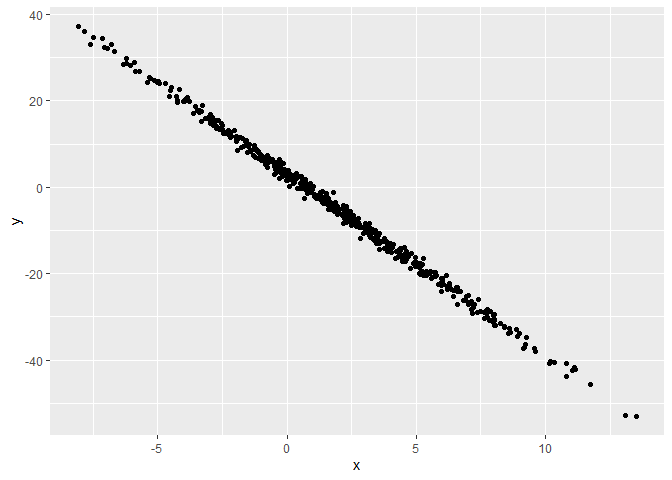

I'm an R Markdown document! 

# Section 1

Here's a **code chunk** that samples from 
a _normal distribution_:


``` r
samp = rnorm(100)
```

# Section 2

#### Subsection 1

I can take the mean of the sample, too!
The mean is -0.0558147.

The code chunk below creates a data frame and generates a plot.


``` r
library(tidyverse)
```

```
## Warning: package 'tidyverse' was built under R version 4.4.1
```

``` r
plot_df = tibble(
  x = rnorm(500, mean = 2, sd = 4),
  y = 3 - 4.2 * x + rnorm(500)
)

ggplot(plot_df, aes(x =x, y = y)) + geom_point()
```

<!-- -->

#### Table

col 1 | col 2
----- | -----
a     | b
c     | d

> Block quote
